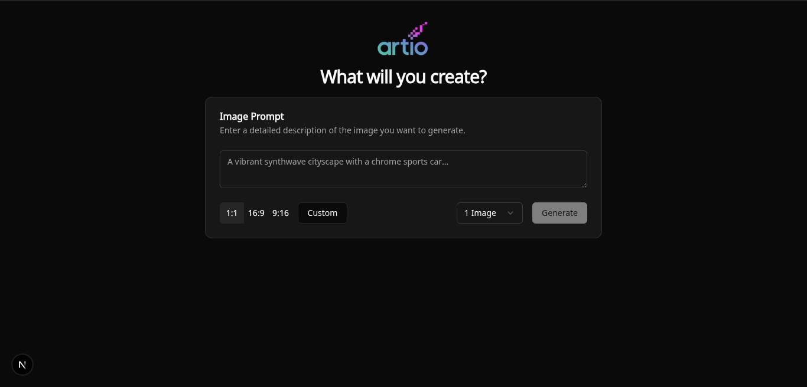
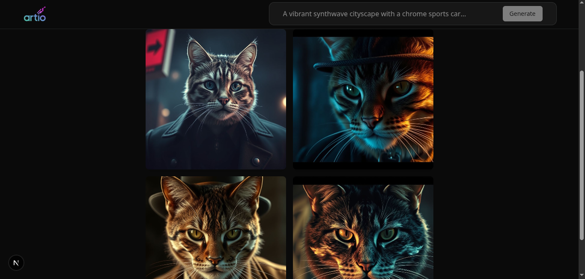

# Artio - Image Generation

Artio is a web application that allows you to generate images using AI.

## Screenshots

Here are some screenshots of the application in action:





## Running the Project

### Development Mode

To run the application in development mode, you'll need to start both the frontend and backend services separately.

**1. Backend (Flask):**

First, ensure you have Python and pip installed. Then, create a virtual environment and install the required dependencies:

```bash
python -m venv venv
source venv/bin/activate  # On Windows, use `venv\Scripts\activate`
pip install -r requirements.txt
```

Once the dependencies are installed, you can start the Flask server:

```bash
flask run
```

The backend will be running at `http://localhost:5000`.

**2. Frontend (Next.js):**

In a separate terminal, navigate to the `artio` directory and install the Node.js dependencies:

```bash
cd artio
npm install
```

Then, start the Next.js development server:

```bash
npm run dev
```

The frontend will be available at `http://localhost:3000`.

### Using Docker Compose

For a more streamlined setup, you can use Docker Compose to run both the frontend and backend services in containers.

First, make sure you have Docker and Docker Compose installed on your system. Then, from the root of the project, run the following command:

```bash
docker-compose up --build
```

This will build the Docker images for both the frontend and backend and start the services.

- The frontend will be accessible at `http://localhost:3000`.
- The backend will be running at `http://localhost:5000`.
